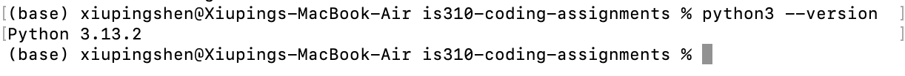
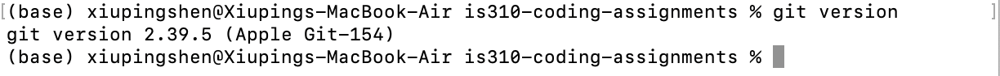
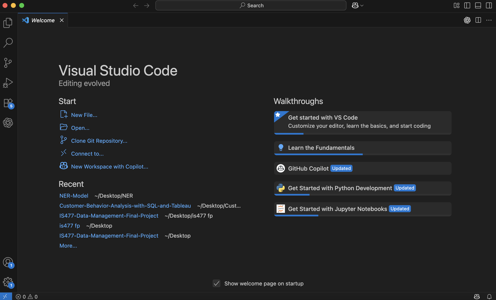

# Init IS310 Homework

## Proof of Installation

1. Python

2. Git

3. VS Code

4. Hypothesis Username: Cynthia Shen (Cynthia387)

5. AI Tool/Workflow 

How will you work with AI? What tools if any do you plan to use? 
ChatGPT
I plan to use AI tools as a support for brainstorming and debugging. 
AI may help me explore ideas, clarify command-line usage when I got troublebut all final decisions, implementations, and interpretations will be my own.
